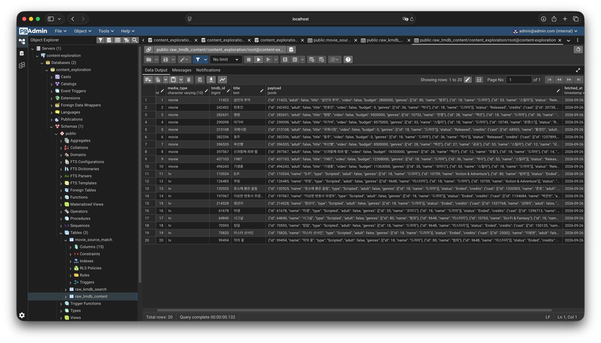
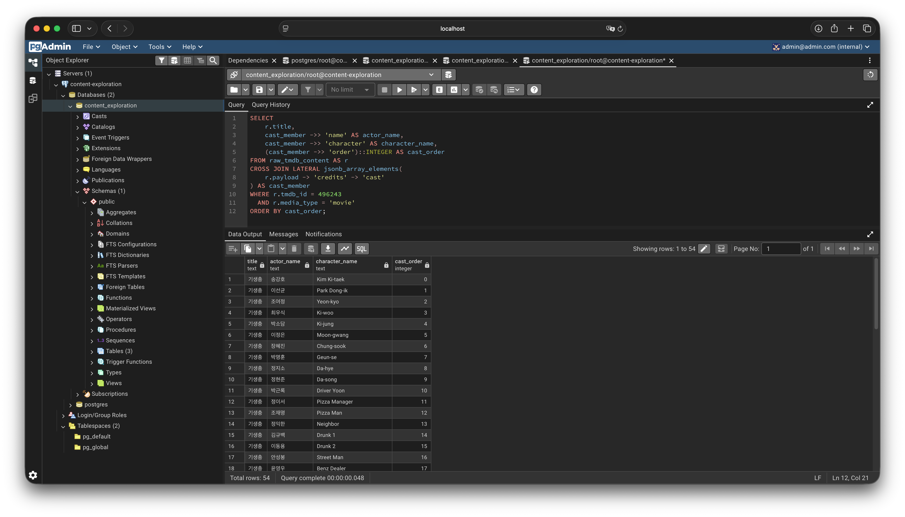
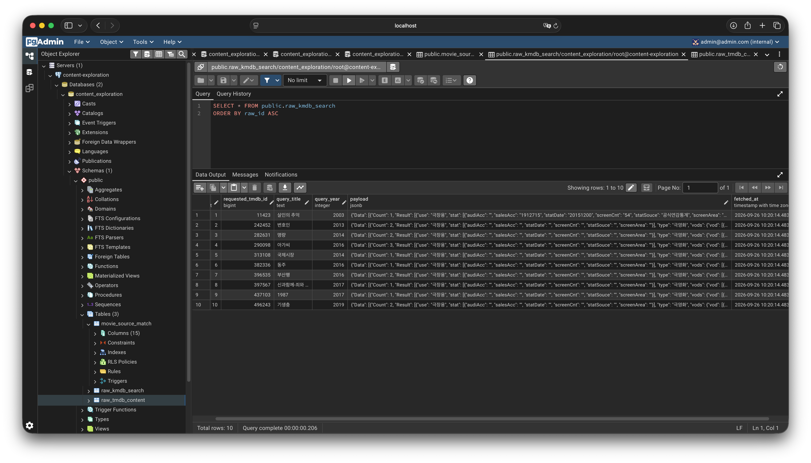
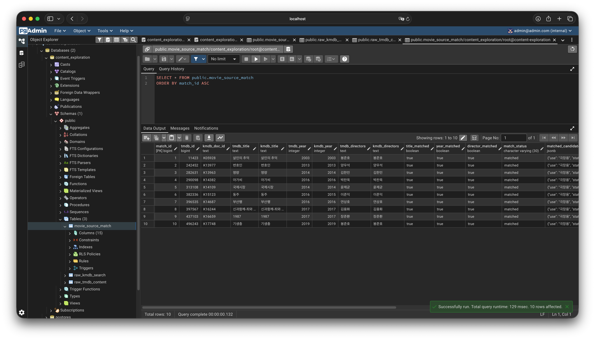

# Content Exploration

## 영화 / 드라마 데이터 수집·적재 파이프라인

`search_tmdb.py`  
제목 검색 → 영화 / 드라마 후보와 TMDB ID 확인

`fetch_tmdb_raw.py`  
선택된 TMDB ID → TMDB 상세 원본 JSON 파일 저장

`load_tmdb_raw.py`  
TMDB 원본 JSON 파일 → PostgreSQL JSONB 적재

`fetch_kmdb_raw.py`  
영화만 → TMDB 제목·연도 기준으로 KMDb 후보 원본 JSON 파일 저장

`load_kmdb_raw.py`  
KMDb 원본 JSON 파일 → PostgreSQL JSONB 적재

`match_movie_sources.py`  
영화만 → TMDB와 KMDb 후보를 제목·연도·감독 기준으로 매칭하고 결과 저장

## 파일 역할

- `tmdb_client.py`: TMDB API 공통 요청 함수 제공
- `search`: 제목 기반 후보 검색. (후보 선택은 사용자 또는 이후 UI가 담당)
- `fetch`: 외부 API 호출 및 원본 JSON 파일 저장
- `load`: 저장된 JSON 파일을 PostgreSQL JSONB로 적재
- `match`: TMDB와 KMDb가 동일 작품인지 확인

## 적재 결과

### TMDB 원본 데이터

## JSONB 데이터 조회 예시

### KMDb 원본 데이터

### TMDB·KMDb 매칭 결과

